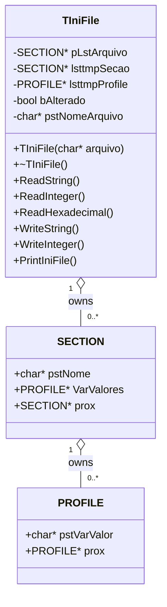
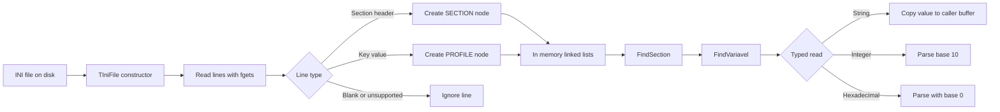
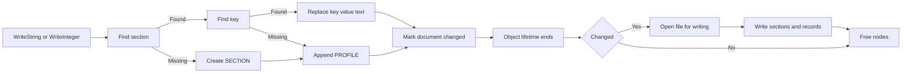

<div align="center">

# TIniFile

### A lightweight, dependency-free INI configuration reader and writer for C++

[](https://isocpp.org/)
[](https://en.cppreference.com/w/cpp/11)
[](Makefile)
[](#design-goals)

Read, query, update, and persist classic `section/key=value` configuration files with a small single-header implementation.

</div>

---

## Contents

- [Why TIniFile](#why-tinifile)
- [Capabilities](#capabilities)
- [Architecture](#architecture)
- [Data flow](#data-flow)
- [Quick start](#quick-start)
- [Usage](#usage)
- [API reference](#api-reference)
- [INI format](#ini-format)
- [Build targets](#build-targets)
- [Behavior and limitations](#behavior-and-limitations)
- [Project layout](#project-layout)
- [Contributing](#contributing)

## Why TIniFile

`TIniFile` is designed for small C++ programs that need human-readable configuration without an external parser. The implementation lives in [`inifiles.h`](inifiles.h), so integration requires only one repository file and a compatible C++ compiler.

### Design goals

- **Small surface area:** one public class and five read/write operations.
- **No runtime dependencies:** uses standard C/C++ library headers.
- **Readable storage:** uses familiar INI sections and key/value records.
- **Predictable defaults:** numeric reads return the supplied fallback when data is missing.
- **Educational internals:** demonstrates linked lists, file I/O, parsing, and cleanup.

## Capabilities

| Capability | Details |
| --- | --- |
| String reads | `ReadString(section, key, buffer)` copies a value into a caller-provided buffer. |
| Integer reads | `ReadInteger(section, key, defaultValue)` parses base-10 integers. |
| Hexadecimal reads | `ReadHexadecimal(section, key, defaultValue)` supports values such as `0xFF00FF00`. |
| String writes | `WriteString(section, key, value)` creates or replaces an entry. |
| Integer writes | `WriteInteger(section, key, value)` creates or replaces an entry. |
| Automatic creation | Missing sections and keys are created while writing. |
| Automatic persistence | Changes are written when the `TIniFile` object is destroyed. |
| Inspection | `PrintIniFile()` prints the in-memory representation. |

## Architecture

The parser loads the file into a two-level singly linked list. `TIniFile` owns the section list; each `SECTION` owns a list of raw `PROFILE` records such as `porta=8080`.



### In-memory representation

```text
TIniFile
└── pLstArquivo ──► SECTION("Geral") ──► SECTION("Rede") ──► null
                    │                      │
                    ▼                      ▼
              PROFILE("nome=...")   PROFILE("porta=9090")
                    │                      └──► PROFILE("mascara=0xFF00FF00")
                    ▼
                  null
```

## Data flow

### Load and read

The labels below deliberately avoid square brackets because GitHub's Mermaid renderer interprets them as syntax in edge labels.



### Write and persist



> **Important:** persistence is destructor-based. Keep the `TIniFile` object alive while performing reads and writes, and allow it to leave scope normally so changes are flushed.

## Quick start

### Requirements

- A compiler exposed as `g++`.
- GNU Make for the provided `Makefile`.
- C++11 support or newer.

```bash
git clone https://github.com/paulocfmarques-collab/inifiles.git
cd inifiles
make
make run
```

The example recreates `teste.ini`, reads values, writes `endereco`, updates `porta`, prints the loaded structure, and persists changes when `TIniFile` is destroyed.

### Direct compilation

```bash
g++ -Wall -Wextra -O2 -std=c++11 teste_inifiles.c -o teste_inifiles
./teste_inifiles
```

With MinGW on Windows:

```bash
g++ -Wall -Wextra -O2 -std=c++11 teste_inifiles.c -o teste_inifiles.exe
./teste_inifiles.exe
```

## Usage

```cpp
#include "inifiles.h"

int main()
{
    char fileName[] = "app.ini";
    char section[] = "Network";
    char hostKey[] = "host";
    char portKey[] = "port";
    char host[TAM_STRING] = { 0 };

    TIniFile ini(fileName);

    if (ini.ReadString(section, hostKey, host))
        printf("Host: %s\n", host);

    int port = ini.ReadInteger(section, portKey, 8080);
    printf("Port: %d\n", port);

    ini.WriteString(section, hostKey, (char*)"127.0.0.1");
    ini.WriteInteger(section, portKey, 9090);

    return 0;
}
```

Changes are written when `ini` is destroyed at the end of the scope.

### Example configuration

```ini
[General]
name=demo

[Network]
host=127.0.0.1
port=9090
mask=0xFF00FF00
```

## API reference

| Method | Return value | Behavior |
| --- | --- | --- |
| `bool ReadString(char* section, char* key, char* value)` | `true` when found | Copies the text after `=` into `value`. |
| `int ReadInteger(char* section, char* key, int defaultValue)` | Parsed integer or default | Parses the value after `=` in base 10. |
| `int ReadHexadecimal(char* section, char* key, int defaultValue)` | Parsed integer or default | Parses using base `0`, supporting prefixes such as `0x`. |
| `bool WriteString(char* section, char* key, char* value)` | `true` | Creates or replaces a string entry. |
| `bool WriteInteger(char* section, char* key, int value)` | `true` | Creates or replaces a decimal entry. |
| `void PrintIniFile()` | — | Prints sections and raw records to standard output. |

`TAM_STRING` is defined as `255` and is the recommended size for buffers passed to `ReadString`.

## INI format

The parser recognizes:

- Section headers beginning with `[` and ending at the last `]`, for example `[Network]`.
- Records stored as `key=value` under the most recently parsed section.
- Empty lines, which are effectively ignored during loading.
- Semicolon-prefixed records, which are not returned by key lookup.

The implementation stores records as raw strings and does not normalize whitespace or preserve comments as structured metadata.

## Build targets

```text
make          # Build teste_inifiles
make run      # Build, then execute teste_inifiles
make clean    # Remove the generated executable
```

Build flags are `-Wall -Wextra -O2 -std=c++11`.

## Behavior and limitations

- **Single-header implementation:** declarations and implementation are both in `inifiles.h`.
- **Fixed read buffer:** input lines are read into a `TAM_STRING`-sized buffer (`255` bytes).
- **C-style API:** public parameters use mutable `char*` buffers rather than `std::string`.
- **Destructor flush:** writes happen when the object is destroyed, not through an explicit `Save()` method.
- **Formatting is regenerated:** original formatting and comments are not preserved as separate objects.
- **Simple lookup:** section and key matching is case-sensitive and uses linear traversal.
- **Not thread-safe:** an instance should not be concurrently mutated from multiple threads.
- **No exception-based error reporting:** failures are represented through return values or defaults where provided.

## Project layout

```text
.
├── inifiles.h          # TIniFile declarations and implementation
├── teste.ini           # Example configuration
├── teste_inifiles.c    # Assert-based usage and smoke test
├── Makefile            # Build, run, and clean targets
└── README.md           # Project documentation
```

## Contributing

1. Fork the repository.
2. Create a focused branch: `git checkout -b feature/your-change`.
3. Run `make clean && make && make run`.
4. Keep changes focused and document user-visible behavior.
5. Open a pull request with a clear description.

Useful contribution areas include safer string handling, explicit save/error reporting, UTF-8 support, comment preservation, deletion APIs, broader tests, and a modern CMake build.

## Author

**Paulo Cesar Furlanetto Marques**  
[github.com/paulocfmarques-collab](https://github.com/paulocfmarques-collab)

---

<div align="center">Made for small, readable C++ configuration workflows.</div>
